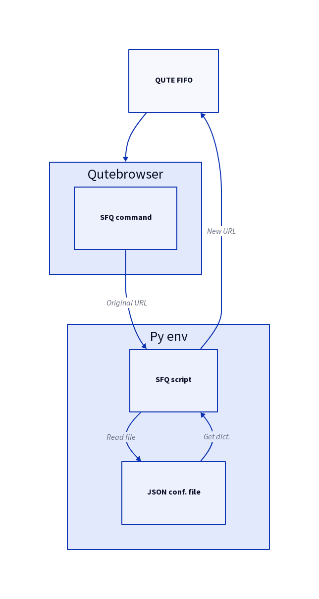

# SwapForQute

> Redirect and clean URLs in qutebrowser.

SwapForQute (or just SFQ) is an userscript for qutebrowser that replaces your URLs with new ones following an easy to set configuration.

See, as an example, this JSON snippet:

```json
{
  "www.reddit.com": {
    "out": "old.reddit.com",
    "force_https": true,
    "clean_queries": true
  },
  "reddit.com": {
    "out": "old.reddit.com",
    "force_https": true,
    "clean_queries": true
  }
}
```

When you bounce on a `www.reddit.com` or `reddit.com` URL, the script automatically tells the browser to search for the corresponding `old.reddit.com` one. As you can see, you can force HTTPS and clean queries, so that all tracking garbage is wiped out in the process.

# Installation and usage
Copy the script under your userscript directory:

``` sh
git clone --depth 1 https://github.com/gicrisf/swapforqute ~/.config/qutebrowser/userscripts
```

Give it the permissions to work on your system:

``` sh
chmod +x ~/.config/qutebrowser/userscripts/swapforqute/main.py
```

Now, edit the configuration as you please:

``` sh
vi ~/.config/qutebrowser/userscripts/swapforqute/config.json
```

It's all ready! Now set the keybindings in qutebrowser in compliance with your needs.

## Alias and keybindings
It's not feasible to write all the command's clutter everytime.
Better writing a simple alias like `:sfq` in `config.py`:

``` python
# Build the command
sfq_base_dir = <where-you-cloned-the-repo>
sfq_script_path = sfq_base_dir + "main.py"
sfq_conf_path = sfq_base_dir + "config.json"
sfq_cmd = "--userscript {} -c {}".format(sfq_script_path, sfq_conf_path)

# Assign the alias
c.aliases['sfq'] = "set-cmd-text -s :spawn {} -u ".format(sfq_cmd)
```

The obvious next step is setting up the keybindings.

``` python
# The following are equivalent!
# We can bind to an alias or directly to the command.

# config.bind('o', "set-cmd-text -s :spawn {} -u ".format(sfq_cmd))
config.bind('o', ':sfq')
```

Personally, I prefer leaving the default command for `o` key and assign `:sfq` to a special sequence, for `f` (hint links) and something else. [Check my qutebrowser literate configuration](https://github.com/gicrisf/qute-config) for a more extended explanation of command building, keybindings and other tricks. 

Of course, you can be creative and came up with your own solutions: the script just process your input to give you an output, but it's up to you where and when to use it.

## Why I wrote this
I avoid running javascript on my browser for a lot of reasons: security, minimizing CPU usage, minimizing tracking... But some sites, usually big ones, heavily relies on JS for rendering content. When possible, I wished I could stay on privacy-friendly and js-free alternative frontends. Classic examples are offered by old reddit frontend VS new reddit frontend, nitter VS twitter, invidious VS youtube. With this script, it's possible to easily achieve all those redirects and every other you happen to think of.

## How it works



## Alternative ways
Before writing this script, I stepped on another userscript that aims at a similar goal, which is [Qutebrowser URL Mutator](https://codeberg.org/mister_monster/qutebrowser-url-mutator); it's thought to be configured via regexes, just like [Firefox "Redirector" extension](https://github.com/einaregilsson/Redirector). If you're used to this kind of workflow or you simply find it attractive, I suggest you to take a look at it.
Mutator was of inspiration for SFQ, so thanks for that!

## Requirements
A Python 3.7 (or newer) installation is required to run the script. It depends on standard libraries only (os, json, urllib, argparse). Obviously, being this an userscript for qutebrowser, [Qutebrowser](https://github.com/qutebrowser/qutebrowser) is required too.

## Support
Why don't you help me keeping myself awake buying me a coffee?
I could use the extra time to add more features!

[](https://ko-fi.com/V7V425BFU)

## License
[MIT](https://github.com/gicrisf/swapforqute/blob/main/LICENSE)
