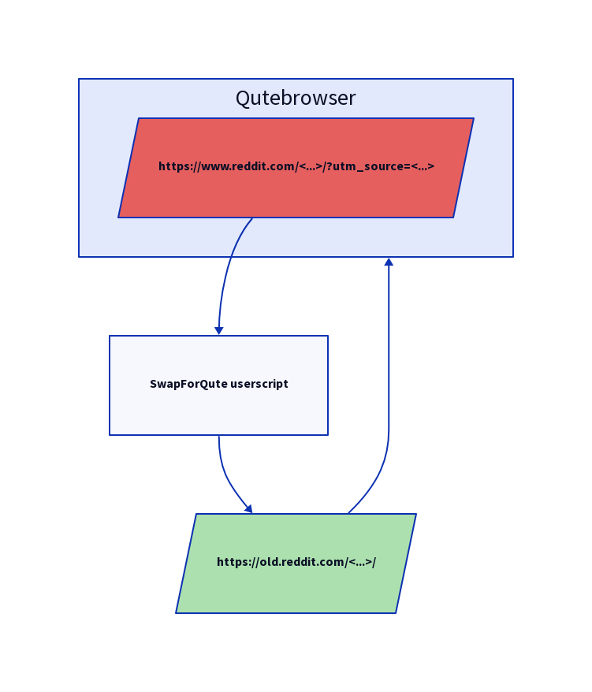
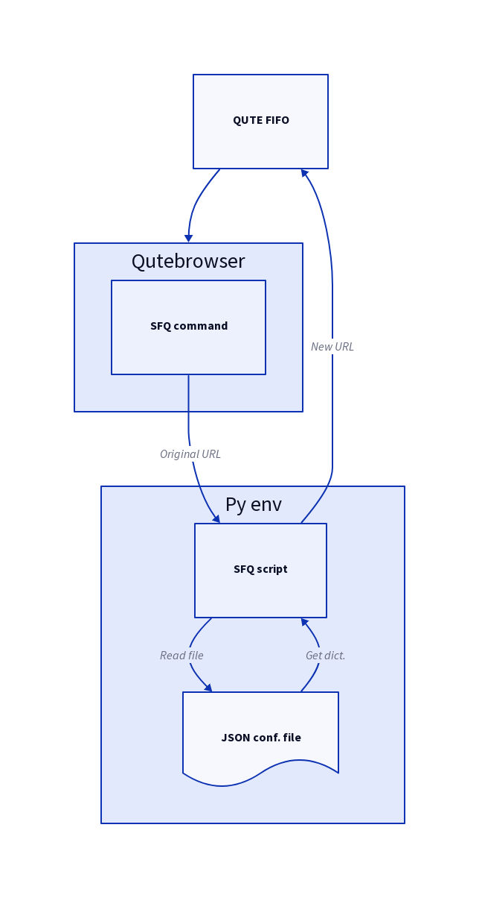

# SwapForQute

> Redirect and clean URLs in qutebrowser.

SwapForQute (or just SFQ) is an userscript for qutebrowser that replaces your URLs with new ones following an easy to set configuration.



The diagram up here show, as an example, what would happen with this configuration in the RULES dictionary:

```python
RULES = {
    'www.reddit.com': {
        'out': 'old.reddit.com',
        'force_https': True,
        'clean_queries': True
    },
    'reddit.com': {
        'out': 'old.reddit.com',
        'force_https': True,
        'clean_queries': True
    }
}
```

When you bounce on a `www.reddit.com` or `reddit.com` URL, the script automatically tells the browser to search for the corresponding `old.reddit.com` one. As you can see, you can force HTTPS and clean queries, so that all tracking garbage is wiped out in the process.
Therefore, something like "https://www.reddit.com/r/emacs/comments/yubhff/zwitterionic_digressions_get_user_inputs_in_emacs/?utm_source=share&utm_medium=web2x&context=3" magically become "https://old.reddit.com/r/emacs/comments/yubhff/zwitterionic_digressions_get_user_inputs_in_emacs".

# Installation and usage

## Quick Install

Use the installation script:

``` sh
curl -fsSL https://raw.githubusercontent.com/gicrisf/swapforqute/main/install.sh | bash
```

Or install manually:

``` sh
# Download the latest release
curl -L -o ~/.config/qutebrowser/userscripts/sfq.py \
  https://github.com/gicrisf/swapforqute/releases/latest/download/sfq.py

# Make it executable
chmod +x ~/.config/qutebrowser/userscripts/sfq.py
```

The script includes built-in example rules that you can customize directly in the script.

## Configuration

SwapForQute supports two configuration approaches:

### 1. Built-in Rules (Recommended)

Edit the `RULES` dictionary directly in `sfq.py` (lines 16-27). This is the simplest approach and requires no additional command-line arguments:

``` python
RULES = {
    'example.com': {
        'force_https': True,
        'out': 'newexample.com',
        'clean_queries': True,
        'clean_fragments': True
    }
}
```

### 2. JSON Configuration (Optional)

For users who prefer keeping configuration separate, you can create a JSON config file anywhere and use the `-c` flag to extend the built-in rules.

Create a JSON file with your custom rules:

``` json
{
  "www.reddit.com": {
    "out": "old.reddit.com",
    "force_https": true,
    "clean_queries": true
  },
  "reddit.com": {
    "out": "old.reddit.com",
    "force_https": true,
    "clean_queries": true
  }
}
```

When you provide a JSON config file, it **extends** (not replaces) the built-in rules. If a domain appears in both, the JSON rule takes precedence.

### Rule Options

For each domain, you can set:
- `out`: Replace the domain with this value
- `force_https`: Force HTTPS scheme (true/false)
- `clean_queries`: Delete all query parameters (true/false)
- `clean_fragments`: Delete URL fragments (true/false)

Every element is optional. You can choose to force https requests without touching the other components of the URL or cleaning the fragments without touching the queries.

It's all ready! Set the aliases/keybindings and you're good to go.

## Alias and keybindings
It's not feasible to write all the command's clutter everytime.
Better writing a simple alias like `:sfq` in `config.py`:

### Using Built-in Rules Only

``` python
# Build the command (no -c flag needed)
sfq_script_path = "~/.config/qutebrowser/userscripts/sfq.py"
sfq_cmd = "--userscript {}".format(sfq_script_path)

# Assign the alias
c.aliases['sfq'] = "set-cmd-text -s :spawn {} --cmd 'open' -u ".format(sfq_cmd)
```

### Using Built-in Rules + JSON Extension

``` python
# Build the command with JSON config (put config.json wherever you want)
sfq_script_path = "~/.config/qutebrowser/userscripts/sfq.py"
sfq_conf_path = "~/.config/qutebrowser/config.json"  # Or any path you prefer
sfq_cmd = "--userscript {} -c {}".format(sfq_script_path, sfq_conf_path)

# Assign the alias
c.aliases['sfq'] = "set-cmd-text -s :spawn {} --cmd 'open' -u ".format(sfq_cmd)
```

### Keybindings

The obvious next step is setting up the keybindings:

``` python
# The following are equivalent!
# We can bind to an alias or directly to the command.

# config.bind('o', "set-cmd-text -s :spawn {} --cmd 'open' -u ".format(sfq_cmd))
config.bind('o', ':sfq')
```

Personally, I prefer leaving the default command for `o` key and assign `:sfq` to a special sequence, for `f` (hint links) and something else. [Check my qutebrowser literate configuration](https://github.com/gicrisf/qute-config) for a more extended explanation of command building, keybindings and other tricks. 

Of course, you can be creative and came up with your own solutions: the script just process your input to give you an output, but it's up to you where and when to use it.

## Why I wrote this
I avoid running javascript on my browser for a lot of reasons: security, minimizing CPU usage, minimizing tracking... But some sites, usually big ones, heavily relies on JS for rendering content. When possible, I wished I could stay on privacy-friendly and js-free alternative frontends. Classic examples are offered by old reddit frontend VS new reddit frontend, nitter VS twitter, invidious VS youtube. With this script, it's possible to easily achieve all those redirects and every other you happen to think of.

## How it works



## Alternative ways
Before writing this script, I stepped on another userscript that aims at a similar goal, which is [Qutebrowser URL Mutator](https://codeberg.org/mister_monster/qutebrowser-url-mutator); it's thought to be configured via regexes, just like [Firefox "Redirector" extension](https://github.com/einaregilsson/Redirector). If you're used to this kind of workflow or you simply find it attractive, I suggest you to take a look at it.
Mutator was of inspiration for SFQ, so thanks for that!

## Requirements
This userscript uses Python standard libraries only. Since it runs in [qutebrowser](https://github.com/qutebrowser/qutebrowser), which depends on Python, all requirements are automatically satisfied.

## Testing
The project includes a comprehensive test suite. Run tests with:
```bash
python -m unittest test_sfq
```

## Support
Why don't you help me keeping myself awake buying me a coffee?
I could use the extra time to add more features!

[](https://ko-fi.com/V7V425BFU)

<a href="https://liberapay.com/gicrisf/donate"></a>

## License
[MIT](https://github.com/gicrisf/swapforqute/blob/main/LICENSE)
